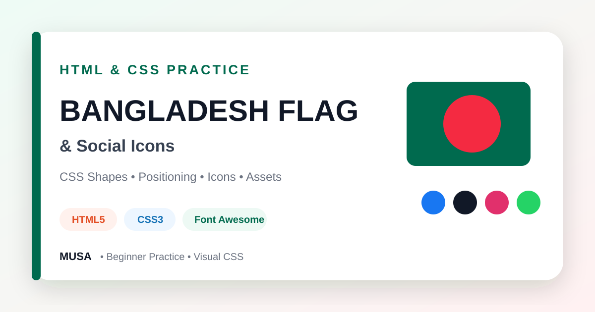

<div align="center">



# Bangladesh Flag & Social Icons — CSS Practice

### A compact HTML and CSS exercise recreating the Bangladesh flag and arranging social-media icons with image assets and Font Awesome.


[](https://github.com/samusa099)
[](https://developer.mozilla.org/docs/Web/HTML)
[](https://developer.mozilla.org/docs/Web/CSS)

[](https://github.com/samusa099/Assignments_03)
[](https://github.com/samusa099/Assignments_03)
[](https://github.com/samusa099/Assignments_03/commits/main)

</div>

---

## 📌 Overview

A focused beginner exercise demonstrating CSS shapes, positioning, colours, icon libraries, image assets, and simple browser-ready project organisation.

## 📚 Documentation

| Resource | Description |
|---|---|
| [**HOW_TO_USE.md**](HOW_TO_USE.md) | Detailed explanation of why, where, and how to use and improve the project |
| [**Repository Cover**](assets/repository-cover.svg) | Scalable professional cover used in this README |

## ✨ Key Features

- Bangladesh flag constructed with CSS shapes
- Image-based social sharing icons
- Font Awesome icon list
- Positioning, spacing, and colour practice
- No framework or build process

## 🛠️ Technology Stack

| Technology | Purpose |
|---|---|
| HTML5 | Page and icon structure |
| CSS3 | Flag shapes, positioning, colours, and layout |
| Font Awesome | Social and interface icons |

## 🗂️ Repository Structure

```text
Assignments_03/
├── index.html
├── css/
├── images/
├── assets/
│   └── repository-cover.svg
├── HOW_TO_USE.md
└── README.md
```

## 🚀 Run Locally

```bash
git clone https://github.com/samusa099/Assignments_03.git
cd Assignments_03
```

Open `index.html` in a browser or use **VS Code Live Server**.

> Social links are placeholders and should be replaced before reuse.

## 👤 Author

<div align="center">

### Musa

**Internationally certified HR professional and data analytics practitioner from Bangladesh.**  
Musa combines people operations, Excel, Power BI, SQL, and technology-driven problem-solving to build practical, structured, and user-focused projects.

[](https://github.com/samusa099)

</div>
